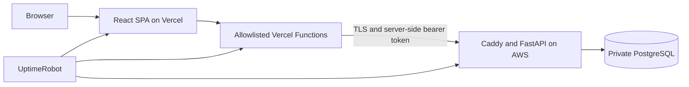

# JobRadar Frontend

Production React client for JobRadar, a self-hosted job intelligence platform that collects remote opportunities, scores them against a deterministic profile, and turns the results into an actionable application workflow.

The interface combines ranked matches, a searchable job catalog, source monitoring, and a device-local Kanban tracker. It uses strict runtime validation at API and storage boundaries, route-level code splitting, accessible UI primitives, and a security-focused deployment configuration.

| Resource | Link |
| --- | --- |
| Live application | [Open JobRadar](https://jobradar-frontend-pink.vercel.app) |
| Service status | [View live uptime](https://stats.uptimerobot.com/pbYg91DSyR) |
| Backend repository | [Bigda7/jobradar](https://github.com/Bigda7/jobradar) |

## Portfolio Highlights

- Built and deployed a responsive React 19 SPA with four production routes and explicit loading, empty, partial-failure, and error states.
- Designed a backend-for-frontend layer with allowlisted Vercel Functions so the browser never receives the upstream API bearer token.
- Validates remote API responses and local persisted state with Zod before data reaches the UI.
- Implements a local application CRM with drag-and-drop, accessible status controls, notes, archive, schema migration, corruption recovery, and cross-tab synchronization.
- Ships through GitHub Actions with locked dependencies, tests, type checking, linting, production builds, dependency auditing, and secret scanning.
- Runs behind Vercel security headers and edge rate limiting, with independent monitoring for the frontend, backend, and full proxy path.

## Architectural Evolution: Personal Client to SaaS v2

- **v1.0 (Current Live Production):** High-density single-tenant dashboard with ranked feed, full-text job search, source health monitoring, and a local drag-and-drop Kanban pipeline with Zod runtime validation.
- **v2.0 (In Active Private Staging):** Multi-tenant SaaS client introducing user sessions, authentication flows, per-user search profiles and scoring criteria, server-persisted Kanban sync, and dedicated account management and notification configuration views.

## Production Architecture



The browser communicates only with same-origin `/api` endpoints. Vercel Functions add the backend credential on the server, validate the upstream response type and size, and expose only the read-only routes used by the application.

## Features

- **Matches feed** — Browse deterministically scored opportunities grouped into Top (`85–100`), Strong (`70–84`), Good (`55–69`), and Below Target tiers. Switch between board and compact list views, sort the loaded page, and inspect reasons, concerns, descriptions, and verified vacancy links in a details drawer.
- **Job catalog** — Search the complete catalog with a debounced query, work mode, employment type, minimum salary, and pagination controls.
- **Source monitoring** — Review each configured source, its enabled state, last run, last successful run, and the latest reported error without synthetic health labels.
- **Application tracker** — Manage a local Kanban pipeline: `Saved -> Applied -> Interview -> Offer`, with a separate archive, drag-and-drop movement, accessible status controls, job snapshots, autosaved notes, and cross-tab synchronization.
- **Command palette** — Use `Cmd+K` on macOS or `Ctrl+/` on Windows and Linux to navigate between sections, search loaded matches, and query remote jobs.
- **Responsive dark interface** — Includes keyboard-accessible dialogs and drawers, focus management, reduced-motion support, and layouts tested down to a 320 px viewport.

## Technology Stack

- React 19 and React Router 7
- TypeScript 5
- Vite 8
- Tailwind CSS 4
- TanStack Query 5
- Zod 4
- dnd-kit
- Radix UI
- cmdk and Lucide React
- Vitest and ESLint

## Requirements

- Node.js `22.13.0` or newer
- npm
- A compatible JobRadar API for live data

The local Vite proxy expects the API to be available at `http://localhost:8000` unless the configuration is changed.

## Getting Started

Clone the repository and enter the project directory:

```bash
git clone https://github.com/your-org/jobradar-frontend.git
cd jobradar-frontend
```

Install dependencies:

```bash
npm install
```

Create a local environment file:

```bash
cp .env.example .env.local
```

On Windows PowerShell:

```powershell
Copy-Item .env.example .env.local
```

Start the development server:

```bash
npm run dev
```

Open `http://localhost:5173`. With the default environment value, requests to `/api` are proxied to `http://localhost:8000`, and the `/api` prefix is removed before forwarding.

## Environment Variables

| Variable | Local value | Production example | Purpose |
| --- | --- | --- | --- |
| `JOBRADAR_API_ORIGIN` | `http://localhost:8000` | `https://api.yourdomain.com` | Server-side proxy target |
| `JOBRADAR_API_TOKEN` | empty when backend auth is disabled | random shared token | Server-side bearer token |

The browser always requests same-origin `/api`. In local development, Vite forwards those requests.
On Vercel, explicit serverless functions forward an allowlisted set of read-only endpoints and add
the bearer token on the server. Never prefix the token with `VITE_`: Vite exposes every `VITE_*`
variable to client-side JavaScript.

The committed [`.env.example`](./.env.example) contains documentation only. Local `.env*` files are excluded from Git, except for `.env.example`.

## Available Scripts

| Command | Description |
| --- | --- |
| `npm run dev` | Start the Vite development server |
| `npm test` | Run the Vitest test suite once |
| `npm run lint` | Run ESLint across the project |
| `npx tsc --noEmit` | Run an explicit TypeScript check |
| `npm run build` | Type-check and create the production bundle |
| `npm run preview` | Preview the production bundle locally |

For reproducible CI installations, use `npm ci` with the committed lockfile.

## API Boundaries

The frontend keeps endpoint contracts intentionally separate:

- `/matches` accepts only `min_score`, `limit`, and `offset` and exposes `source_url`.
- `/jobs` accepts `q`, `work_mode`, `employment_type`, `min_salary`, `limit`, and `offset` and exposes `source_url`.
- `/sources` displays factual source fields returned by the API.
- `/ready` powers the API readiness indicator.

All successful responses are validated with Zod before they reach the UI. Network failures, validation errors, server failures, malformed JSON, and unexpected response shapes are converted into explicit application error states.

## Local Tracker Data

Tracker records are stored under the versioned key `jobradar.tracker.v1` in `localStorage`.

- Stored values are parsed and validated before use.
- Corrupted records are isolated where possible instead of resetting the entire tracker.
- Unsafe external URL schemes are removed.
- Notes are limited to 5,000 characters.
- Storage access failures degrade to in-memory session behavior instead of crashing the application.
- Updates are synchronized across tabs through the browser `storage` event.

Tracker data is device-local, unencrypted, and not backed up. Do not store passwords, access tokens, financial information, medical information, or other sensitive data in personal notes.

## Security

- Untrusted descriptions, reasons, concerns, source errors, and notes are rendered as React text nodes. The application does not use `dangerouslySetInnerHTML`.
- External vacancy links accept only absolute HTTP or HTTPS URLs and use `target="_blank"` with `rel="noopener noreferrer"`.
- API and persisted-state payloads are validated with Zod.
- Query retries are limited to transient network and server errors.
- A root error boundary handles unexpected render and lazy-chunk failures without exposing stack traces.
- [`vercel.json`](./vercel.json) defines a Content Security Policy and additional browser security headers.

Run `npm audit` regularly and review every dependency update before merging it.

## Deployment to Vercel

1. Import the repository into Vercel.
2. Set the build command to `npm run build`.
3. Set the output directory to `dist`.
4. Add these server-side environment variables for Preview and Production environments:

   ```text
   JOBRADAR_API_ORIGIN=https://api.yourdomain.com
   JOBRADAR_API_TOKEN=the_same_random_token_configured_on_the_backend
   ```

5. Keep the token out of all `VITE_*` variables and confirm it is scoped to Preview and Production
   as intended.
6. If the application is private, enable [Vercel Deployment Protection](https://vercel.com/docs/deployment-protection)
   for every URL, including the production domain. The server-side proxy prevents token disclosure
   but does not authenticate individual visitors by itself.
7. Deploy and verify `/api/health`, `/api/ready`, `/api/jobs`, `/api/matches`, plus direct
   navigation to `/matches`, `/jobs`, `/tracker`, and `/sources`.
8. Protect the production domain, require the CI workflow on `main`, and review the generated
   deployment before promoting it.

The explicit `/api/*.ts` functions take precedence over the SPA rewrite. The proxy accepts GET
only, uses an upstream timeout, rejects redirects, HTML, and oversized responses, and returns no
backend credential to the browser. The SPA rewrite serves `index.html` for application routes.

## Project Structure

```text
src/
|-- api/                 # API client, endpoint modules, schemas, and DTOs
|-- components/          # Shared shell, command palette, and UI primitives
|-- features/
|   |-- jobs/            # Job catalog and filters
|   |-- matches/         # Ranked feed, score tiers, and details
|   |-- sources/         # Source monitoring dashboard
|   `-- tracker/         # Local CRM store and Kanban board
|-- hooks/               # Debounce and accessibility hooks
|-- security/            # External URL policy
`-- styles.css           # Tailwind import, design tokens, and global styles
```

## Publication Notes

- Local environment files, database dumps, private keys, and generated output are excluded through `.gitignore`.
- Review `git status` before every commit.
- Run a secret scanner in CI in addition to dependency auditing.

## License

The JobRadar source code is available under the [MIT License](LICENSE).

Job listings, company names, trademarks, logos, and data obtained from external services remain
the property of their respective owners and are not relicensed by this project.
